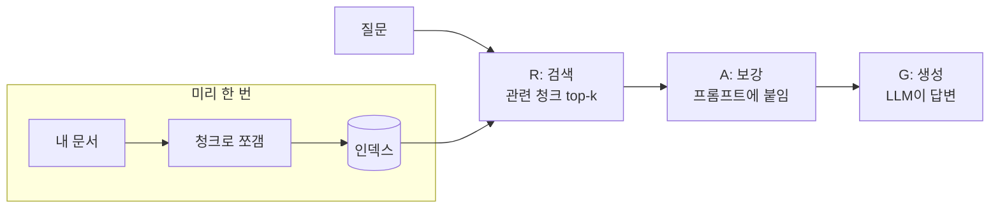
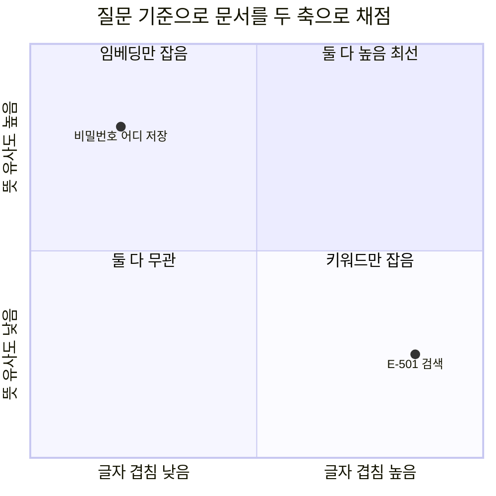
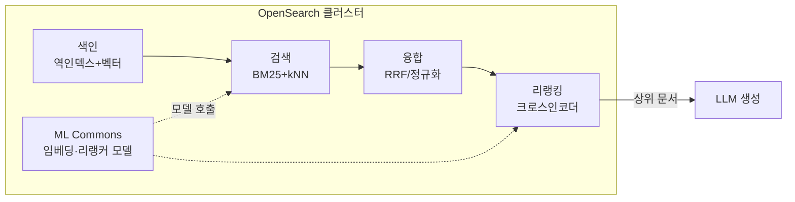
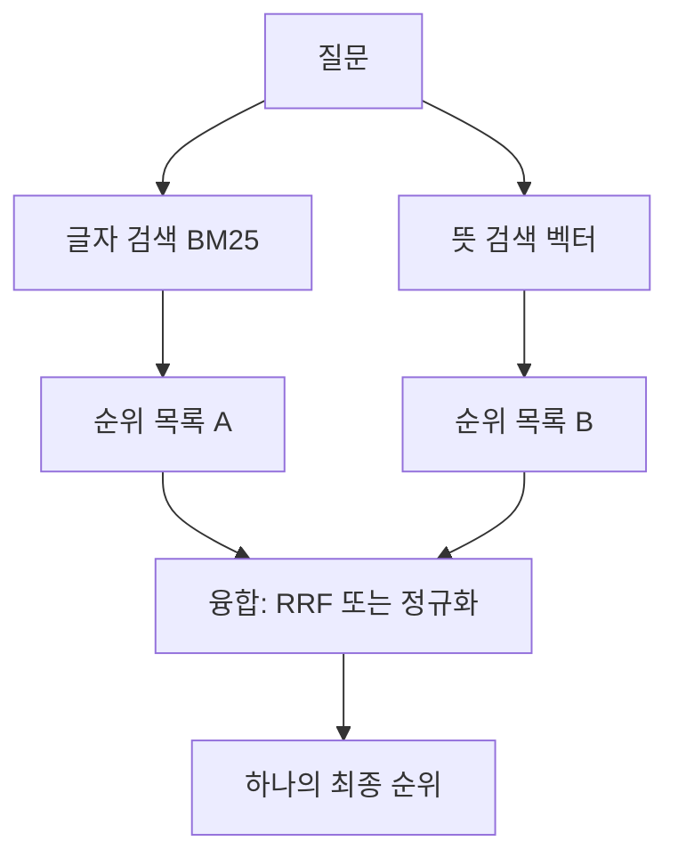

# AI 활용 / Claude Code 학습 노트

> 시작: 2026-07-09
> 방식: AI와 대화하며 배운 것을 실시간 기록. 새 내용은 항상 끝에 추가한다.

---

## 1. 왜 시작했나

Andrej Karpathy의 ["전문가가 되는 법"](https://x.com/karpathy/status/1325154823856033793) 세 가지를 따르기 위해서.

1. 구체적인 프로젝트를 반복해서 맡아 깊이(depth-wise), 끝까지 해낸다 — 필요한 것을 그때그때(on demand) 배우고, 기초부터 넓게(bottom-up breadth-wise) 배우지 않는다
2. 배운 것을 전부 내 언어로, 남을 가르치듯(teach) 정리한다
3. 과거의 나와만 비교하고, 남과는 비교하지 않는다

**AI 활용과 Claude Code**를 주제로, 세 단계로 돈다:
실전에서 걸린 문제를 파고들어 직접 확인하고(1) → 이 파일에 노트로 적립한 뒤 쌓이면 블로그에 가르치듯 발행하고(2) → 정리 세션마다 "예전의 나는 뭘 몰랐나"를 회고한다(3).

---

## 2. 깨달은 것 (누적 요약)

> 노트가 쌓이면 여기에 핵심만 3~5줄로 계속 갱신한다.

- AI에게 일을 시킬 때는 "결과"가 아니라 **"확인 가능한 상태"**를 요구해야 한다.
- 자동화가 실패하는 지점은 대부분 코드가 아니라 **인증·권한·환경(PATH)** 이다.

---

## 3. 질문 목록

> 세션마다 던진 질문을 번호로 쌓는다. 상세는 아래 노트 번호와 매칭.

| # | 질문 | 노트 |
|---|------|------|
| 1 | GitHub 토큰은 어디에 저장돼 있고, 어떤 게 진짜로 쓰이나? | 노트 1 |
| 2 | gh CLI 로그인이 토큰으로 안 될 때 무엇이 문제인가? | 노트 2 |
| 3 | 커스텀 스킬은 어떻게 만들고, 언제 어떻게 발동되나? | 노트 3 |
| 4 | RAG가 뭔가? R, A, G가 각각 뭔가? | 노트 4 |
| 5 | 왜 "비밀번호" 질문은 검색 0점이 났나? 임베딩은 뭐가 다른가? | 노트 5 |
| 6 | 글자 축 / 뜻 축이 뭔지 잘 모르겠다 (E-501은 어느 사분면?) | 노트 6 |
| 7 | OpenSearch는 이 검색 파이프라인에서 어디에 쓰이나? | 노트 7 |
| 8 | 질의 임베딩은 안/밖 어디서 되나? 바꾸면 재색인해야 하나? | 노트 8 |
| 9 | RAG 검색 엔진은 OpenSearch만 있는 게 아닐 텐데, 왜 많이 쓰나? | 노트 9 |
| 10 | 하이브리드가 여기서 정확히 어떤 의미인가? RRF는 왜 단위 문제를 없애나? | 노트 10 |

---

## 4. 노트

### 노트 1 — git 인증 정보는 세 군데에 흩어질 수 있다 (2026-07-09)

git 계정을 확인해 보니 인증 정보가 세 곳에 있었다.

1. `git config`의 `user.password` — **잘못된 위치**. git은 이 값을 쓰지 않고, 평문 노출만 된다. (만료된 토큰이었고 삭제함)
2. `~/.git-credentials` — `credential.helper=store`일 때 실제로 쓰이는 곳. `https://<계정>:<토큰>@github.com` 형식.
3. `gh` CLI 자체 로그인 — git과 별개로 자기만의 인증을 가진다.

⚠️ `git push`가 되는 것과 `gh`가 되는 것은 **별개의 인증**이다.

확인 방법:

```bash
git config --global --list          # user.* 와 credential.helper 확인
cat ~/.git-credentials              # 실제 저장된 계정 확인 (토큰 노출 주의)
gh auth status                      # gh 로그인 상태
```

토큰이 살아있는지, 어느 계정인지는 API로 바로 확인할 수 있다:

```bash
curl -s -H "Authorization: token <토큰>" https://api.github.com/user
# → "login" 필드가 계정명. 만료면 "Bad credentials"
```

### 노트 2 — gh 로그인은 토큰 스코프가 발목을 잡는다 (2026-07-09)

`gh auth login --with-token`은 토큰에 `read:org` 스코프가 없으면 거부한다.
하지만 **REST API 직접 호출은 그 스코프 없이도 된다.**

```bash
# gh 없이 레포 생성
curl -X POST -H "Authorization: token <토큰>" \
  https://api.github.com/user/repos \
  -d '{"name":"my-repo","private":false}'
```

⚠️ "gh가 안 됨" ≠ "토큰이 죽음". 스코프 문제일 수 있으니 API로 토큰 자체를 먼저 검증할 것.

### 노트 3 — 스킬은 SKILL.md 파일 하나로 시작하고, description이 곧 트리거다 (2026-07-09)

학습 노트를 자동으로 적립하는 `/study-log` 스킬을 직접 만들면서 확인한 것.

스킬의 실체는 마크다운 파일 하나다:

```
~/.claude/skills/study-log/SKILL.md    # 개인(전역) 스킬 — 모든 프로젝트에서 사용
<프로젝트>/.claude/skills/<이름>/       # 프로젝트 스킬 — 해당 저장소에서만
플러그인 제공 스킬                       # plugin:skill 형태로 네임스페이스가 붙음
```

구조는 frontmatter + 본문 절차서:

```markdown
---
name: study-log
description: ...학습 노트에 추가하고 커밋한다. "노트에 추가해줘"라고 하면 사용...
---
# 절차
1. 파일 읽고 마지막 노트 번호 확인
2. ...
```

핵심 깨달음 두 가지:

1. **description이 코드가 아니라 트리거다.** 모델이 사용자의 말과 description을 대조해서 스스로 호출을 결정한다. 그래서 description에는 기능 설명보다 **"사용자가 어떤 말을 하면 써라"**를 적어야 잘 발동된다.
2. **본문은 그냥 지시문이다.** 프로그램이 아니라 모델이 읽고 따르는 절차서라서, 사람에게 인수인계 문서 쓰듯 금지사항("append-only, 과거 노트 수정 금지")까지 적어두면 그대로 지켜진다.

⚠️ "새 스킬은 세션을 다시 시작해야 뜬다"고 예상했는데 **틀렸다.** SKILL.md를 저장하자마자 같은 세션의 스킬 목록에 바로 나타났다 — 스킬 목록은 세션 중에도 갱신된다. 예상과 실제가 다를 수 있으니 항상 직접 확인할 것.

### 노트 4 — RAG는 아무것도 쌓지 않는다 — 질문마다 찾아 붙였다 버린다 (2026-07-10)

**상황**: RAG가 뭔지 아예 몰라서(R, A, G가 무슨 약자인지도) 처음부터 학습 세션을 시작했다.

**예상**: "검색한 걸 쌓는 건가??" → ⚠️ 틀렸다.

**확인한 것**:

RAG = Retrieval-Augmented Generation. 오픈북 시험이다 — LLM이 암기(파라미터)로만 답하게 하지 않고, 책에서 관련 페이지를 찾아 펴놓고 답하게 한다.

| 글자 | 하는 일 | 오픈북 비유 |
|---|---|---|
| **R** (Retrieval, 검색) | 질문과 관련된 문서 조각을 찾는다 | 책에서 관련 페이지 찾기 |
| **A** (Augmented, 보강) | 찾은 조각을 프롬프트에 끼워 넣는다 | 그 페이지를 펴놓기 |
| **G** (Generation, 생성) | LLM이 그걸 읽고 답을 만든다 | 답안 작성 |

'R' 부분을 임베딩 없이 순수 파이썬으로 직접 돌려봤다. 이 학습 노트 파일(`ko/study-notes.md`) 자체를 문서 삼아, `### 노트` 단위로 청크를 쪼개고 "질문과 겹치는 단어 개수"를 점수로 매기는 검색기:

```python
import re
from collections import Counter

text = open("ko/study-notes.md").read()
chunks = ["### " + c for c in re.split(r"\n### ", text) if c.startswith("노트")]

def tokens(s):
    return Counter(re.findall(r"[a-zA-Z가-힣]{2,}", s.lower()))

def search(query):                      # 겹치는 단어 수 = 점수
    q = tokens(query)
    for c in chunks:
        d = tokens(c)
        print(sum(min(q[w], d[w]) for w in q), c.splitlines()[0])
```

```
질문: 'gh 토큰 스코프가 없어서 로그인이 안 돼요'
  점수 3 | 노트 2 — gh 로그인은 토큰 스코프가 발목을 잡는다   ← 정답
질문: '스킬은 어떻게 만들어요?'
  점수 2 | 노트 3 — 스킬은 SKILL.md 파일 하나로 시작하고...   ← 정답
```

이 정도 grep 수준 검색으로도 RAG의 R이 된다. 이 다음은 1등 청크를 "이 문서를 참고해서 답해"라고 질문 앞에 붙여주면(A) LLM이 답을 만든다(G). 검색이 실패하는 경우는 노트 5에서.

**그림**:



**결론**: RAG는 LLM이 모르는 내 문서에 대해 답하게 하려고, 질문이 올 때마다 문서에서 관련 조각을 찾아서 질문 옆에 붙여준 다음 답을 만들게 하는 것.

**써먹기**: Claude Code가 내 파일을 찾아 읽고 답하는 것 자체가 RAG(agentic retrieval)다. 사내 문서·위키 질의응답을 만들 때 이 구조 그대로 쓰면 된다.

⚠️ "검색한 걸 쌓는다"고 예상했는데 틀렸다. 검색 결과는 그 질문 한 번에만 프롬프트에 붙였다가 버린다 — LLM은 기억도 학습도 하지 않고, 다음 질문이 오면 처음부터 다시 검색한다. 미리 만들어 재사용하는 것은 인덱스(사전 준비)뿐이다.

원문: [Lewis et al. 2020 (RAG 원조 논문)](https://arxiv.org/abs/2005.11401), [Anthropic — Contextual Retrieval](https://www.anthropic.com/news/contextual-retrieval)

### 노트 5 — 키워드 검색은 글자를 비교하고, 임베딩 검색은 뜻을 비교한다 (2026-07-10)

**상황**: 노트 4의 미니 검색기에 "비밀번호는 어디에 보관되나요?"를 물었더니, 정답인 노트 1(git 인증 정보 저장 위치)을 포함해 전부 0점이 나왔다.

**예상**: "패스워드는 어디 저장돼?"로 바꿔 물어도 0점일 것 → 맞았다.

**확인한 것**:

```
질문:   [비밀번호, 어디, 보관]
노트 1: [인증, 정보, 토큰, credentials, 저장, ...]
겹치는 단어: 없음 → 0점
```

노트 1에는 "비밀번호"라는 단어가 한 번도 안 나온다. 키워드 검색은 뜻을 모르고 글자만 비교하기 때문에, 검색기에게 `비밀번호`와 `토큰`은 `비밀번호`와 `바나나`만큼 남남이다. "패스워드는 어디 저장돼?"로 바꿔 물어도 예상대로 노트 3개 전부 0점.

임베딩 검색이 이걸 해결한다. 임베딩 모델은 문장을 숫자 목록(벡터)으로 바꾸는데, **뜻이 비슷한 문장일수록 가까운 벡터가 나오도록** 방대한 텍스트로 미리 학습돼 있다("비밀번호"와 "토큰"이 늘 비슷한 문맥에서 등장한다는 걸 이미 안다). 질문도 벡터로 바꿔서 거리가 가장 가까운(코사인 유사도가 가장 높은) 청크를 고르면, 단어가 하나도 안 겹쳐도 노트 1이 1등으로 올라온다.

```
        ● "비밀번호는 어디에 보관되나요?" (질문)
      ● "git 인증 정보 저장 위치" (노트 1)        ← 뜻이 비슷 → 가까움
                                  ● "스킬 만드는 법" (노트 3)   ← 뜻이 다름 → 멂
```

**결론**: 키워드 검색은 글자를, 임베딩 검색은 뜻을 비교한다. 실무는 보통 둘을 섞은 하이브리드 — 고유명사·에러코드는 키워드가 강하고, 말바꿈·동의어는 임베딩이 강하다.

관련: 노트 4

### 노트 6 — "축"은 비유가 아니라 진짜 2차원 평면이다 (2026-07-20)

**상황**: 사내 RAG 챗봇의 검색 계층(OpenSearch 색인·임베딩·하이브리드·리랭킹)을 조사하다가, "글자 축 / 뜻 축"이라는 말이 계속 안 잡혔다. 축이 뭔데?

**예상**: "에러코드 `E-501`이 뭔지" 찾는 질문의 정답 문서는 **2사분면(왼쪽 위 = 뜻○·글자✗, 임베딩이 잡는 자리)**일 것 → ⚠️ 틀렸다.

**확인한 것**:

두 축 = 문서 하나에 던지는 **서로 다른 두 질문**이다. 가로축은 "질문 단어가 글자 그대로 있나?"(BM25), 세로축은 "단어가 달라도 뜻이 비슷한가?"(임베딩). 두 답이 따로 놀기 때문에 문서는 점수 하나가 아니라 **(글자점수, 뜻점수) 좌표 = 평면 위의 점**이 된다. 그래서 "축"은 비유가 아니라 문자 그대로 좌표축이다.

- 노트 5의 "비밀번호 어디 저장?" → 정답(노트 1)은 "비밀번호"란 단어가 없어 글자 0점, 뜻만 높음 → **2사분면(왼쪽 위)**. 임베딩이 구제.
- `E-501`은 **정반대**다. 코드가 문서에 그 글자 그대로 박혀 있어 글자 겹침 최고, 반대로 임베딩은 `E-501` 같은 코드·숫자를 뜻으로 잘 못 잡는다(자연어 의미가 빈약) → **4사분면(오른쪽 아래, 글자○·뜻✗)**. 결정적 축은 키워드(BM25).

두 정답이 평면의 **대각선 반대편**에 찍힌다 → 한 축만 쓰면 반드시 한쪽 종류의 질문을 놓친다.

**그림**:



**결론**: 글자 축과 뜻 축은 독립이라 문서는 평면 위의 점이고, 질문 종류(코드·고유명사 vs 말바꿈·동의어)에 따라 정답이 대각선 반대편에 찍힌다 — 그래서 하이브리드가 둘 다 본다.

**써먹기**: 사내 문서 검색에서 에러코드·제품명·API명 질의는 BM25 가중치를, 자연어 설명 질의는 임베딩 가중치를 높이는 근거가 된다.

⚠️ `E-501`을 임베딩이 잡을 거라 예상했는데, 코드·숫자야말로 임베딩이 약하고 키워드가 강한 대표 케이스였다. "낯선 단어 = 임베딩"이 아니라 "낯선 단어라도 뜻이 있어야 임베딩, 뜻 없는 기호는 키워드".

관련: 노트 5, 노트 4

### 노트 7 — OpenSearch는 검색 계층 전체를 담는 그릇이고, 바깥은 LLM뿐이다 (2026-07-20)

**상황**: "내가 맡은 OpenSearch가 이 RAG 파이프라인에서 정확히 어디에 쓰이나?"가 안 그려졌다. 색인·임베딩·하이브리드·리랭킹이 각각 딴 시스템인 줄 알았다.

**확인한 것**:

네 기능이 전부 OpenSearch 하나의 기능이다.

| 단계 | OpenSearch가 하는 일 |
|---|---|
| 색인 | 역인덱스(Nori 형태소) + 벡터인덱스(HNSW)를 한 인덱스에 저장 |
| 검색 | BM25 쿼리 + 벡터 kNN 쿼리를 `hybrid` 쿼리로 병렬 실행 |
| 융합 | search pipeline의 normalization-processor / RRF로 두 점수 결합 |
| 리랭킹 | rerank / ml_inference search pipeline로 크로스인코더 재정렬 |

즉 "OpenSearch 색인·임베딩·하이브리드·리랭킹"이라는 내 역할 = **OpenSearch 클러스터 안을 설계하는 일**. RAG의 **R(검색) 전부가 OpenSearch**, G(생성) LLM만 바깥이다. 임베딩·리랭커 "모델"만 안(ML Commons)/밖(TEI+connector) 선택이 갈릴 뿐, 언제 어디에 적용할지 오케스트레이션은 OpenSearch가 한다.

**그림**:



**결론**: OpenSearch = retrieval 엔진. 검색 깔때기에서 LLM 하나만 빼면 전부 OpenSearch다.

**써먹기**: 내 역할 범위 = OpenSearch 인덱스·파이프라인 설계 + 모델 서빙 위치(클러스터 안 vs 외부 TEI) 결정.

관련: 노트 4

### 노트 8 — 문서와 질의는 같은 임베딩 공간이어야 하고, 그걸 바꾸면 재색인이다 (2026-07-20)

**상황**: "질의를 벡터로 바꾸는 계산은 OpenSearch 안에서 되나 밖에서 되나?"를 물으며 임베딩의 색인/검색 대칭을 봤다.

**예상**: 질의 임베딩은 OpenSearch 안에서도(neural 쿼리) 밖에서도(미리 벡터 계산) 된다 → 맞았다. BM25는 "같은 임베딩 모델" 제약에서 자유롭다 → 맞았다.

**확인한 것**:

색인=문서 벡터화(미리 한 번), 검색=질의 벡터화(질의마다), 둘은 **같은 모델의 같은 동작**이고 대상만 다르다.

- 🔑 문서와 질의는 **반드시 같은 모델·같은 벡터공간**. 다르면 좌표계가 어긋나 비교 자체가 불가능 → 검색이 통째로 망가진다. 그래서 모델을 바꾸면 **전체 문서를 재색인**해야 한다.
- 재색인이 필요한지의 본질 = **"색인 시점에 구워진 것을 바꾸나"**. 벡터 축은 문서가 벡터로 굳어 저장되니 모델 교체 = 재색인. 글자 축은 문서가 토큰(형태소)으로 굳으니 Nori 설정·사전 교체 = 재색인.
- 단 글자 축엔 탈출구가 있다: **동의어**는 검색용 분석기(search analyzer)에만 넣으면 기존 색인을 그대로 두고 질의 확장만으로 반영 → 재색인 불필요. 벡터 축엔 이런 분리가 없다.

**결론**: "무엇이 색인 때 구워지나"가 재색인 비용을 결정한다. 벡터는 바꾸면 항상 재색인, 글자는 부분적으로(동의어 등) 탈출구가 있어 더 유연하다.

**써먹기**: 임베딩 모델 업그레이드 = 전체 재색인 계획 필수(alias 전환 blue-green). 동의어 사전 보강은 무중단 반영 가능.

관련: 노트 5

### 노트 9 — 축이 하나면 전용 도구, 둘이면 OpenSearch, 이미 있으면 재활용 (2026-07-20)

**상황**: RAG 검색 엔진이 OpenSearch만 있는 게 아닌데, 왜 OpenSearch가 많이 쓰이나 궁금했다.

**예상**: 뜻 축(벡터)만 필요한 프로젝트라면 벡터 전용 DB가 OpenSearch보다 나을 것 → 맞았다.

**확인한 것**:

RAG 검색 엔진 후보는 크게 네 유형이다.

| 유형 | 예시 | 성격 |
|---|---|---|
| 벡터 전용 DB | Pinecone, Milvus, Qdrant, Weaviate | 뜻 축 특화, 태생이 벡터 |
| 검색 엔진 + 벡터 | OpenSearch, Elasticsearch | 글자 축(BM25)이 원래 강했고 벡터를 얹음 |
| DB 확장 | pgvector, Redis | 기존 DB에 벡터 추가 |
| 라이브러리 | FAISS | ANN 계산만, DB 아님 |

OpenSearch가 많이 쓰이는 이유:
1. **하이브리드가 네이티브** — 최고 수준 BM25(Lucene) + 벡터 kNN이 한 시스템에. 두 축을 `hybrid` 쿼리 한 방으로. 벡터 전용 DB는 글자 축(정확한 코드·고유명사)이 약하다.
2. **Apache 2.0 오픈소스 자체 호스팅** — on-prem에 올려 데이터가 밖으로 안 나감. Pinecone(SaaS)·Elasticsearch(제한 라이선스)와 갈리는 지점. 사내 챗봇 요건에 직결.
3. **검색 엔진의 성숙한 기능** — 메타데이터 필터(부서·권한), 한국어 Nori, 샤딩/복제, 모니터링.
4. **이미 깔려 있는 경우가 많음** — 로그·검색용 재활용.

트레이드오프: 초대형 벡터(수십억)·순수 벡터 속도는 전용 DB가 빠르고, 운영이 무겁다(JVM 힙·샤드 튜닝).

**결론**: 필요한 축이 하나면 그 축에 특화된 전용 도구가 이긴다. 축이 둘(글자+뜻)이면 OpenSearch, 이미 깔려 있으면 재활용.

**써먹기**: 사내(on-prem·한국어·하이브리드 필요)엔 OpenSearch가 스위트스폿. "우린 벡터만 필요"는 생각보다 드물다 — 에러코드·제품명이 섞이면 결국 글자 축이 필요해진다.

관련: 노트 6, 노트 7

### 노트 10 — 하이브리드는 두 검색을 각각 돌려 두 순위를 하나로 합치는 것 (2026-07-20)

**상황**: "하이브리드가 정확히 무슨 의미?"가 뭉뚱그려져 있어서 정확히 뜯어봤다.

**확인한 것**:

하이브리드 = 질문 하나에 **글자 검색(BM25)과 뜻 검색(벡터)을 둘 다 따로 돌린 뒤, 나온 두 순위 목록을 하나로 융합**하는 것. 똑똑한 쿼리 하나가 아니라 진짜로 두 번 검색한다.

진짜 어려운 건 **합치기**다. 두 점수의 단위가 안 맞기 때문(BM25 0~수십, 벡터 0~1). 그냥 더하면 숫자 큰 BM25가 이겨버린다. 그래서 융합 장치가 필요하다:
- **정규화**: 둘 다 [0,1]로 맞춰 가중 평균 (예: 글자 0.3 + 뜻 0.7)
- **RRF**: 점수를 버리고 등수만 합침 → 단위 문제 자체가 사라짐

**예상(RRF가 왜 단위 문제를 없애나)**: "등수는 상한이 정해져 있어서" → 반은 맞고 반은 부족했다.
- 맞은 부분: 등수는 두 검색이 **같은 범위·같은 척도**(1등·2등…)를 써서 바로 비교된다.
- 놓친 핵심: 등수는 **점수 간격(크기)을 통째로 버린다.** BM25가 1등 95점·2등 3점(격차 큼)이든 벡터가 1등 0.81·2등 0.80(격차 작음)이든, 등수로는 똑같이 "1등, 2등". 그래서 한쪽 이상치가 융합을 지배 못 한다. 공식은 `1/(k + 등수)`, 오직 등수만 들어간다.
- 대가: 미세한 점수 차이 정보를 버리니, 정밀 튜닝을 끝까지 하면 정규화가 살짝 더 정확할 수 있다(벤치마크에서 RRF가 NDCG@10 약 3.86% 낮았던 이유).

하이브리드는 이게 **아니다**: 임베딩만 쓰는 것(뜻 축 하나뿐), 리랭킹(융합된 상위 후보를 크로스인코더로 재정렬하는 그다음 단계).

**그림**:



**결론**: 하이브리드 = 두 축 검색을 각각 돌려 점수 단위를 맞춰 하나의 순위로 합치는 것. RRF는 점수를 등수로 바꿔 단위·이상치 문제를 한 번에 없앤다.

**써먹기**: 정확 매칭이 섞이는 사내 검색은 하이브리드가 기본. 시작은 RRF(운영 단순·재보정 불필요), 정밀도를 끝까지 짜야 하면 정규화 가중치를 A/B 튜닝.

관련: 노트 6, 노트 9

---

## 5. 한눈에 보는 큰 그림

```
git push ──> ~/.git-credentials (credential.helper=store)
gh CLI   ──> 자체 로그인 (scope: repo + read:org 필요)
REST API ──> 토큰만 있으면 됨 (scope는 엔드포인트별)
```

---

## 6. 다음 파볼 주제

- [x] Claude Code의 skill 구조 (노트 3)
- [ ] agent(서브에이전트) 구조 — 컨텍스트가 어떻게 격리되나
- [ ] hook 구조 — 어떤 시점에 무엇이 실행되나
- [ ] CLAUDE.md와 메모리가 실제로 언제 로드되는지
- [ ] MCP 서버 연결 구조
- [ ] gh 토큰을 fine-grained token으로 재발급해서 스코프 정리
- [ ] 임베딩 검색을 진짜 임베딩 모델로 돌려보기 — 0점이었던 "비밀번호" 질문이 정말 노트 1을 찾는지 (노트 5의 후속)
- [ ] 청킹 전략 — 문서를 어떻게 쪼개야 검색이 잘 되나 (Anthropic contextual retrieval 글 정독)
- [x] 글자 축 / 뜻 축을 2차원으로 이해 (노트 6)
- [x] OpenSearch가 검색 파이프라인에서 차지하는 범위 (노트 7)
- [x] 임베딩 색인/검색 대칭과 재색인 조건 (노트 8)
- [ ] 하이브리드 최소 실험 — 같은 질의로 BM25만 vs 벡터만 vs RRF 결과를 나란히 비교 (노트 6의 후속)
- [ ] bge-m3 vs KURE 한국어 임베딩을 사내 문서 골든셋으로 자체 벤치 (NDCG@10)
- [ ] 재색인 실무 — alias 전환(blue-green)으로 무중단 재색인 (노트 8의 후속)
- [ ] HNSW가 그래프로 최근접 이웃을 어떻게 빨리 찾나 (ef_search/m 파라미터의 의미)
